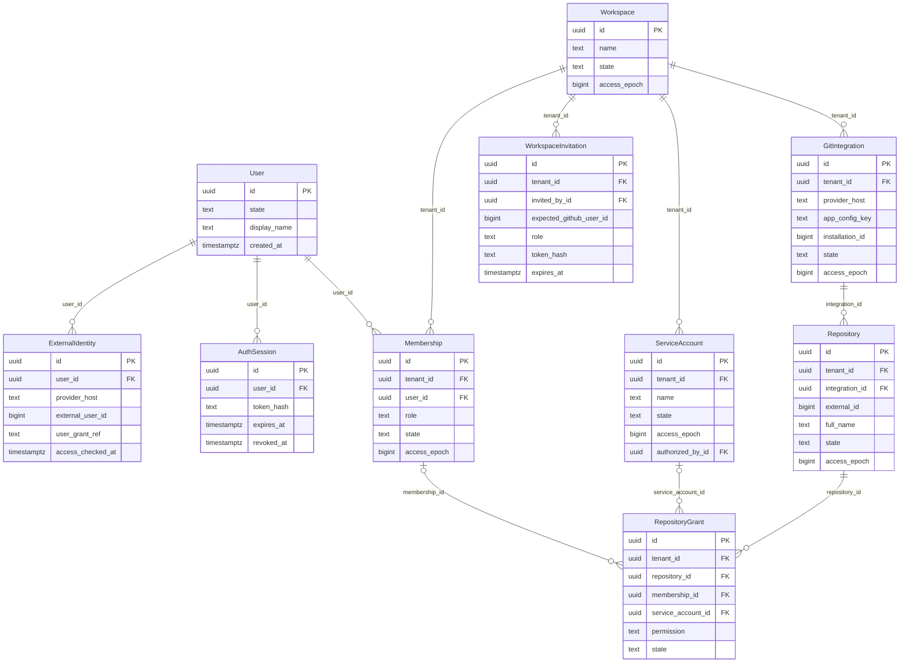
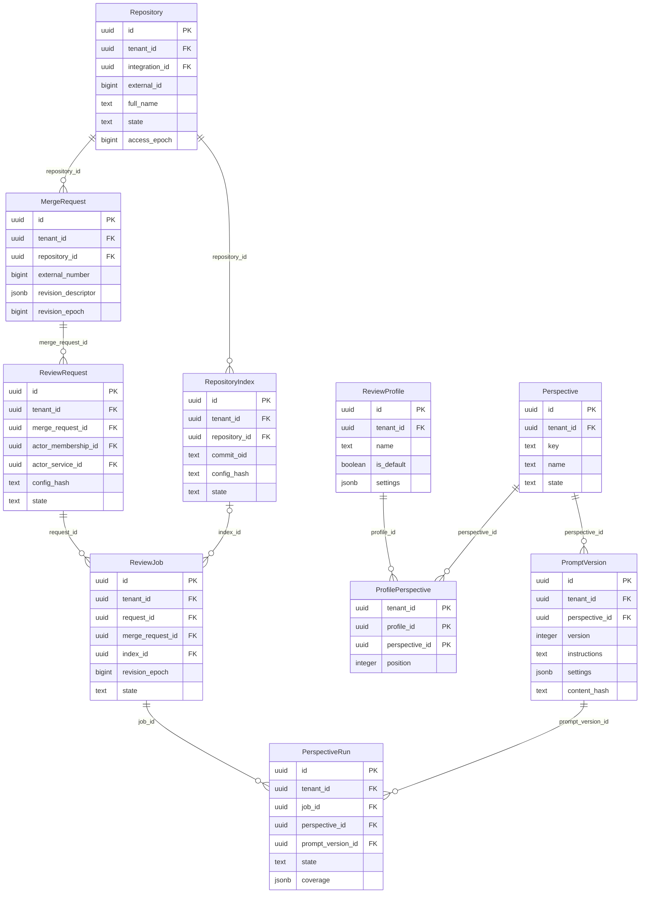
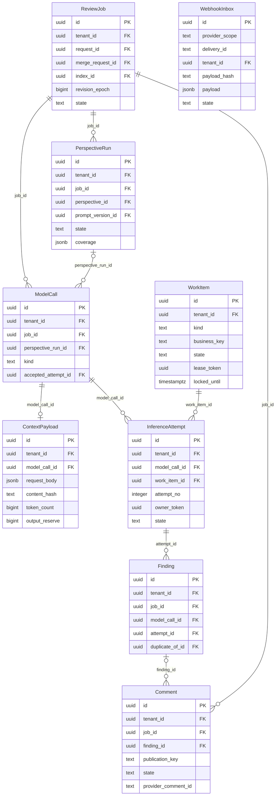
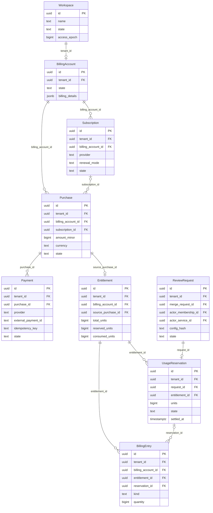

# Схема PostgreSQL — приложение к архитектуре v2.3

**Статус:** проект таблиц, типов, ключей и прикладных ограничений. Схемы встроены ниже как блоки Mermaid; для их графического отображения нужен просмотрщик Markdown с поддержкой Mermaid. Поля и ограничения также приведены в текстовых таблицах. Это не исполняемая DDL и не проверенная миграция.

**Источник правил хранения.** Имена сущностей, поля, nullable, допустимые значения `state`, FK/UNIQUE/CHECK задаёт этот словарь. Бизнес-требования `RQ-*`, роли и открытые решения находятся в [архитектуре](../BACKEND_ARCHITECTURE.md#rules); порядок повторов — в [протоколе](QUEUE_RECOVERY.md#recovery-map). Версия комплекта должна совпадать. Диаграммы — сокращённые проекции, а не самостоятельный источник новых колонок.

**Контракт чтения.** Найдите `DB-*` ниже; прочитайте таблицу полей **и абзацы ограничений под ней**, затем связанные сущности. `PK` подразумевает `NOT NULL`. Примеры составных связей и проверки в тексте обязательны для проектирования, но полная DDL ещё не создана. Слова «статус», «tenant», «job» в пояснениях не создают поля `status`, `tenant` или `job`: имена колонок берутся из таблиц. Недостающие SQL-типы/переходы/значения не угадывать; оформить вопрос к схеме. Существенное изменение требует обновления словаря, схемы и миграции вместе.

### Навигация по сущностям

| ID | Каноническое имя | Назначение |
|---|---|---|
| DB-01 | [User](#db-user) | Пользователь |
| DB-02 | [ExternalIdentity](#db-externalidentity) | Внешняя личность |
| DB-03 | [AuthSession](#db-authsession) | Сессия SaaS |
| DB-04 | [Workspace](#db-workspace) | Рабочее пространство |
| DB-05 | [Membership](#db-membership) | Членство и роль |
| DB-06 | [WorkspaceInvitation](#db-workspaceinvitation) | Приглашение |
| DB-07 | [ServiceAccount](#db-serviceaccount) | Субъект автоматизации |
| DB-08 | [GitIntegration](#db-gitintegration) | Установка GitHub App |
| DB-09 | [GitConnectionSession](#db-gitconnectionsession) | Подключение App |
| DB-10 | [Repository](#db-repository) | Подключённый репозиторий |
| DB-11 | [RepositoryGrant](#db-repositorygrant) | Разрешение репозитория |
| DB-12 | [MergeRequest](#db-mergerequest) | GitHub Pull Request |
| DB-13 | [ReviewProfile](#db-reviewprofile) | Профиль ревью |
| DB-14 | [Perspective](#db-perspective) | Перспектива |
| DB-15 | [ProfilePerspective](#db-profileperspective) | Состав профиля |
| DB-16 | [PromptVersion](#db-promptversion) | Версия промпта |
| DB-17 | [ReviewRequest](#db-reviewrequest) | Одна продуктовая операция |
| DB-18 | [RepositoryIndex](#db-repositoryindex) | Индекс commit |
| DB-19 | [ReviewJob](#db-reviewjob) | Запуск одной ревизии |
| DB-20 | [PerspectiveRun](#db-perspectiverun) | Отдельный запуск перспективы |
| DB-21 | [ModelCall](#db-modelcall) | Логический вызов модели |
| DB-22 | [ContextPayload](#db-contextpayload) | Неизменяемый вход |
| DB-23 | [InferenceAttempt](#db-inferenceattempt) | Попытка инференса |
| DB-24 | [Finding](#db-finding) | Замечание |
| DB-25 | [Comment](#db-comment) | Намерение публикации |
| DB-26 | [WorkItem](#db-workitem) | Надёжная команда |
| DB-27 | [WebhookInbox](#db-webhookinbox) | Входящая квитанция |
| DB-28 | [BillingAccount](#db-billingaccount) | Платёжный аккаунт |
| DB-29 | [Subscription](#db-subscription) | Месячный договор |
| DB-30 | [Purchase](#db-purchase) | Один заказ |
| DB-31 | [Payment](#db-payment) | Операция выбранного провайдера |
| DB-32 | [Entitlement](#db-entitlement) | Право и квота |
| DB-33 | [UsageReservation](#db-usagereservation) | Резерв одного ревью |
| DB-34 | [BillingEntry](#db-billingentry) | Журнал прав |

Метки `DB-*` — адреса документации, не новые таблицы или ID записей. Номера сохраняются между редакциями. `ProfilePerspective` — явная таблица связи; `MergeRequest` — единственная внутренняя модель GitHub PR.

## 1. Визуальные схемы

Отдельные исходники Mermaid: [docs/erd](erd/README.md).

Четыре проекции одной модели, а не четыре базы. Повторённая таблица обозначает тот же объект. [Вернуться к архитектуре](../BACKEND_ARCHITECTURE.md).

### Пользователи и доступ

### Репозиторий и ревью

### Выполнение и публикация

### Оплата и право на ревью

## 2. Общие соглашения

Внутренние PK — UUID. NN — NOT NULL; NULL — допустимо отсутствие; PK/FK — ключ/ссылка. Даты — timestamptz, epoch/ID провайдера/счётчики — bigint. Размеры JSONB/текстов и прикладные сроки задаются конечными пределами. Статусы фиксированных процессов ограничиваются CHECK. Роли — небольшой фиксированный набор в Membership; отдельная универсальная таблица permission не требуется.

У tenant-таблицы с глобальным id дополнительно нужен UNIQUE(tenant_id, id), если на неё ссылается составной FK. Вложенные FK содержат tenant и необходимые ID родителей: одинаковый tenant ещё не означает одинаковый job. User, ExternalIdentity и AuthSession глобальны. WebhookInbox до проверенной привязки — закрытое исключение, не публичный доступ к чужим данным.

В схемах показаны ключевые поля и основные связи. Все поля и ограничения ниже относятся к проекту; при создании физической ERD их нужно согласовать с SQLAlchemy metadata и миграцией. Ключевые таблицы имеют created_at/updated_at по необходимости; они опущены там, где не влияют на контракт. Циклические ссылки accepted_attempt/accepted_payment добавляются после создания обеих сторон.

## 3. Словарь таблиц

### DB-01 · User — Пользователь

| Поле | PostgreSQL | Ограничение | Значение |
|---|---|---|---|
| `id` | `uuid` | PK | Глобальный ID человека |
| `state` | `text` | NN | active / suspended |
| `display_name` | `text` | NN | Отображение; не идентичность |
| `created_at` | `timestamptz` | NN | Дата создания |

В User нет role, tenant_id или is_paid. Один человек участвует в нескольких пространствах.

### DB-02 · ExternalIdentity — Внешняя личность

| Поле | PostgreSQL | Ограничение | Значение |
|---|---|---|---|
| `id` | `uuid` | PK | ID связи |
| `user_id` | `uuid` | FK NN | User |
| `provider_host` | `text` | NN | Разрешённый хост GitHub |
| `external_user_id` | `bigint` | NN | Стабильный GitHub user ID |
| `user_grant_ref` | `text` | NULL | Ссылка на защищённые credentials |
| `access_checked_at` | `timestamptz` | NULL | Последняя проверка внешнего доступа |

UNIQUE(provider_host, external_user_id). Login и email не идентификаторы и не основание объединять аккаунты. Пара токенов хранится защищённо за user_grant_ref; смена пары выполняется согласованно, не параллельными refresh.

### DB-03 · AuthSession — Сессия SaaS

| Поле | PostgreSQL | Ограничение | Значение |
|---|---|---|---|
| `id` | `uuid` | PK | ID сессии |
| `user_id` | `uuid` | FK NN | User |
| `token_hash` | `text` | NN | Hash случайного session token |
| `expires_at` | `timestamptz` | NN | Конечный срок |
| `revoked_at` | `timestamptz` | NULL | Отзыв |

UNIQUE(token_hash). Cookie содержит непрогнозируемый токен, а не роль или Git access token. Роль и grant перечитываются сервером; отзыв не ждёт истечения cookie.

### DB-04 · Workspace — Рабочее пространство

| Поле | PostgreSQL | Ограничение | Значение |
|---|---|---|---|
| `id` | `uuid` | PK | Tenant ID |
| `name` | `text` | NN | Имя |
| `state` | `text` | NN | active / disabled / deleting |
| `access_epoch` | `bigint` | NN | Поколение правил доступа |

Для активного workspace нужен хотя бы один active owner. Проверяется сценарием под блокировкой Workspace, а не обычным построчным CHECK.

### DB-05 · Membership — Членство и роль

| Поле | PostgreSQL | Ограничение | Значение |
|---|---|---|---|
| `id` | `uuid` | PK | ID участия |
| `tenant_id` | `uuid` | FK NN | Workspace |
| `user_id` | `uuid` | FK NN | User |
| `role` | `text` | NN | owner / admin / member / viewer / billing_manager |
| `state` | `text` | NN | active / suspended / revoked |
| `access_epoch` | `bigint` | NN | Поколение прав участия |

UNIQUE(tenant_id, user_id), UNIQUE(tenant_id, id). Роль принадлежит участию, а не человеку целиком. Admin назначает только member/viewer; привилегированные роли назначает owner. Последний owner защищён общей блокировкой workspace.

### DB-06 · WorkspaceInvitation — Приглашение

| Поле | PostgreSQL | Ограничение | Значение |
|---|---|---|---|
| `id` | `uuid` | PK | ID |
| `tenant_id` | `uuid` | FK NN | Workspace |
| `invited_by_id` | `uuid` | FK NN | Membership инициатора |
| `expected_github_user_id` | `bigint` | NN | Предназначенный адресат по стабильному ID |
| `role` | `text` | NN | Роль, назначенная приглашающим |
| `token_hash` | `text` | NN | Hash одноразового секрета |
| `expires_at` | `timestamptz` | NN | Срок |
| `accepted_membership_id` | `uuid` | FK NULL | Созданное/подтверждённое членство |
| `state` | `text` | NN | pending / accepted / expired / revoked |

UNIQUE(token_hash). FK инициатора/результата составные по tenant. Принятие проверяет адресата через ExternalIdentity, срок и полномочия приглашавшего. Токен не позволяет выбрать другую роль.

### DB-07 · ServiceAccount — Субъект автоматизации

| Поле | PostgreSQL | Ограничение | Значение |
|---|---|---|---|
| `id` | `uuid` | PK | ID |
| `tenant_id` | `uuid` | FK NN | Workspace |
| `name` | `text` | NN | Имя автоматизации |
| `state` | `text` | NN | active / disabled |
| `access_epoch` | `bigint` | NN | Поколение доступа |
| `authorized_by_id` | `uuid` | FK NN | Membership одобрившего |

Не имеет пользовательской cookie и роли admin. Доступ определяется отдельными RepositoryGrant и установленной App. Отключение субъекта запрещает новые действия и принятие результатов его незавершённых запросов.

### DB-08 · GitIntegration — Установка GitHub App

| Поле | PostgreSQL | Ограничение | Значение |
|---|---|---|---|
| `id` | `uuid` | PK | ID |
| `tenant_id` | `uuid` | FK NN | Workspace |
| `provider_host` | `text` | NN | GitHub host |
| `app_config_key` | `text` | NN | Ссылка на конфигурацию приложения/окружения |
| `installation_id` | `bigint` | NN | ID установки |
| `state` | `text` | NN | pending / active / suspended / removed |
| `access_epoch` | `bigint` | NN | Поколение доступа |
| `verified_at` | `timestamptz` | NULL | Последняя сверка |

UNIQUE(provider_host, app_config_key, installation_id). Одна установка — один workspace в этой версии. App private key и installation tokens не поля этого объекта; они управляются адаптером и хранилищем секретов.

### DB-09 · GitConnectionSession — Подключение App

| Поле | PostgreSQL | Ограничение | Значение |
|---|---|---|---|
| `id` | `uuid` | PK | ID |
| `tenant_id` | `uuid` | FK NN | Workspace |
| `initiator_id` | `uuid` | FK NN | Membership |
| `oauth_state_hash` | `text` | NN | Hash одноразового OAuth state |
| `pkce_ref` | `text` | NN | Защищённый verifier |
| `expires_at` | `timestamptz` | NN | Срок |
| `state` | `text` | NN | pending / authorized / completed / rejected |

UNIQUE(oauth_state_hash). Составной FK tenant+initiator. Callback не активирует установку по непроверенному installation_id. App-владелец, установка, внешний пользователь и права проверяются server-side; replay callback идемпотентен.

### DB-10 · Repository — Подключённый репозиторий

| Поле | PostgreSQL | Ограничение | Значение |
|---|---|---|---|
| `id` | `uuid` | PK | ID |
| `tenant_id` | `uuid` | FK NN | Workspace |
| `integration_id` | `uuid` | FK NN | GitIntegration |
| `external_id` | `bigint` | NN | GitHub repository ID |
| `full_name` | `text` | NN | Отображение owner/name |
| `state` | `text` | NN | active / disabled / deleting |
| `access_epoch` | `bigint` | NN | Поколение доступа |

UNIQUE(tenant_id, integration_id, external_id). FK (tenant_id, integration_id) → GitIntegration(tenant_id, id). Переименование репозитория не меняет внешний ID. Неизвестный или недоступный fork не скачивается по произвольному URL.

### DB-11 · RepositoryGrant — Разрешение репозитория

| Поле | PostgreSQL | Ограничение | Значение |
|---|---|---|---|
| `id` | `uuid` | PK | ID |
| `tenant_id` | `uuid` | FK NN | Workspace |
| `repository_id` | `uuid` | FK NN | Repository |
| `membership_id` | `uuid` | FK NULL | Человек |
| `service_account_id` | `uuid` | FK NULL | Автоматизация |
| `permission` | `text` | NN | read / review / manage |
| `state` | `text` | NN | active / revoked |

CHECK: задан ровно один из membership_id и service_account_id; составные FK всех ссылок по tenant. Частичные UNIQUE(tenant_id, repository_id, membership_id) для membership_id IS NOT NULL и UNIQUE(tenant_id, repository_id, service_account_id) для service_account_id IS NOT NULL. Grant только ограничивает ресурсы; не отменяет роль и фактические права GitHub. Owner/admin не получают чтение исходников автоматически.

### DB-12 · MergeRequest — GitHub Pull Request

| Поле | PostgreSQL | Ограничение | Значение |
|---|---|---|---|
| `id` | `uuid` | PK | Внутреннее имя MR для PR |
| `tenant_id` | `uuid` | FK NN | Workspace |
| `repository_id` | `uuid` | FK NN | Целевой Repository |
| `external_number` | `bigint` | NN | Номер PR в репозитории |
| `revision_descriptor` | `jsonb` | NN | Source/target IDs, точные refs и версия формы |
| `revision_epoch` | `bigint` | NN | Поколение принятой ревизии |
| `refresh_requested_seq` | `bigint` | NN | Поколение потребности сверки |
| `refresh_applied_seq` | `bigint` | NN | Погашенная потребность |
| `refresh_lease_token` | `uuid` | NULL | Владелец внешней сверки |
| `refresh_locked_until` | `timestamptz` | NULL | Срок сверки |
| `last_confirmed_at` | `timestamptz` | NULL | Свежесть ревизии |

UNIQUE(tenant_id, repository_id, external_number). Epoch растёт при принятом изменении, SHA не сортируется. Проверка целостности descriptor и доступа source fork принадлежит Git-адаптеру. Поздний ответ с потерянным refresh token не применяется; новый сигнал за время запроса не погашается старым ответом.

### DB-13 · ReviewProfile — Профиль ревью

| Поле | PostgreSQL | Ограничение | Значение |
|---|---|---|---|
| `id` | `uuid` | PK | ID |
| `tenant_id` | `uuid` | FK NN | Workspace |
| `name` | `text` | NN | Имя |
| `is_default` | `boolean` | NN | Профиль по умолчанию |
| `settings` | `jsonb` | NN | Редактируемые настройки |

UNIQUE(tenant_id, name); частичный UNIQUE(tenant_id) WHERE is_default. Состав перспектив хранится в ProfilePerspective. Изменение профиля не меняет config_snapshot принятого запроса.

### DB-14 · Perspective — Перспектива

| Поле | PostgreSQL | Ограничение | Значение |
|---|---|---|---|
| `id` | `uuid` | PK | ID |
| `tenant_id` | `uuid` | FK NN | Workspace |
| `key` | `text` | NN | general/frontend/backend/qa/po/devops/security либо custom |
| `name` | `text` | NN | Отображаемое имя |
| `state` | `text` | NN | active / archived |

UNIQUE(tenant_id, key). Значения перспектив не PostgreSQL enum; системные шаблоны материализуются в tenant.

### DB-15 · ProfilePerspective — Состав профиля

| Поле | PostgreSQL | Ограничение | Значение |
|---|---|---|---|
| `tenant_id` | `uuid` | PK FK | Workspace |
| `profile_id` | `uuid` | PK FK | ReviewProfile |
| `perspective_id` | `uuid` | PK FK | Perspective |
| `position` | `integer` | NN | Порядок выполнения |

PK(tenant_id, profile_id, perspective_id), UNIQUE(tenant_id, profile_id, position). Составные FK предотвращают чужие перспективы.

### DB-16 · PromptVersion — Версия промпта

| Поле | PostgreSQL | Ограничение | Значение |
|---|---|---|---|
| `id` | `uuid` | PK | ID |
| `tenant_id` | `uuid` | FK NN | Workspace |
| `perspective_id` | `uuid` | FK NN | Perspective |
| `version` | `integer` | NN | Положительный номер |
| `instructions` | `text` | NN | Инструкция |
| `settings` | `jsonb` | NN | Настройки агента |
| `content_hash` | `text` | NN | Hash содержимого |

UNIQUE(tenant_id, perspective_id, version). Содержимое неизменяемо; новая редакция — новая запись.

### DB-17 · ReviewRequest — Одна продуктовая операция

| Поле | PostgreSQL | Ограничение | Значение |
|---|---|---|---|
| `id` | `uuid` | PK | ID |
| `tenant_id` | `uuid` | FK NN | Workspace |
| `merge_request_id` | `uuid` | FK NN | PR |
| `actor_membership_id` | `uuid` | FK NULL | Ручной инициатор |
| `actor_service_id` | `uuid` | FK NULL | Автоматический инициатор |
| `idempotency_key` | `text` | NN | Ключ исходной команды |
| `request_hash` | `text` | NN | Hash исходного тела |
| `config_snapshot` | `jsonb` | NN | Зафиксированные перспективы, промпты, политики |
| `config_hash` | `text` | NN | Hash конфигурации |
| `budget` | `jsonb` | NN | Заданные конечные пределы |
| `reserved_tokens` | `bigint` | NN | Текущие резервы вычислений |
| `accounted_tokens` | `bigint` | NN | Известный и консервативный расход |
| `track_latest` | `boolean` | NN | Разрешено ли ограниченное замещение job |
| `deadline_at` | `timestamptz` | NN | Срок продуктовой операции |
| `state` | `text` | NN | accepted / running / succeeded / partial / failed / cancelled / expired |

XOR actor_membership_id/actor_service_id; составные FK по tenant. Две частичные UNIQUE: (tenant_id, actor_membership_id, idempotency_key) для человека и (tenant_id, actor_service_id, idempotency_key) для автоматики. Endpoint создания операции фиксирован. Для автоматического запуска ключ выводится из сервисного субъекта, PR, вида триггера, подтверждённой эпохи и версии политики, а не только из delivery_id webhook. UNIQUE(tenant_id, id, merge_request_id) поддерживает принадлежность job. Ограничения ресурсов проверяются под блокировкой Request.

### DB-18 · RepositoryIndex — Индекс commit

| Поле | PostgreSQL | Ограничение | Значение |
|---|---|---|---|
| `id` | `uuid` | PK | ID |
| `tenant_id` | `uuid` | FK NN | Workspace |
| `repository_id` | `uuid` | FK NN | Точный исходный Repository |
| `commit_oid` | `text` | NN | Commit, не ветка |
| `config_hash` | `text` | NN | Версия и режим индексатора |
| `state` | `text` | NN | building / ready / failed |
| `manifest` | `jsonb` | NN | Файлы и объекты снимка |
| `graph` | `jsonb` | NULL | Ограниченные узлы/связи |
| `artifact_hash` | `text` | NULL | Hash готового артефакта |

UNIQUE(tenant_id, repository_id, commit_oid, config_hash). Готовое содержимое неизменяемо, manifest/graph имеют предел размера. Индекс точного commit не является общим current_graph всех PR. Cache tenant-isolated.

### DB-19 · ReviewJob — Запуск одной ревизии

| Поле | PostgreSQL | Ограничение | Значение |
|---|---|---|---|
| `id` | `uuid` | PK | ID |
| `tenant_id` | `uuid` | FK NN | Workspace |
| `request_id` | `uuid` | FK NN | ReviewRequest |
| `merge_request_id` | `uuid` | FK NN | Тот же PR |
| `index_id` | `uuid` | FK NULL | Индекс head после подготовки |
| `revision_fingerprint` | `text` | NN | Hash descriptor |
| `revision_epoch` | `bigint` | NN | Зафиксированное поколение |
| `config_hash` | `text` | NN | Конфигурация Request |
| `state` | `text` | NN | queued / running / succeeded / partial / failed / cancelled / superseded / expired |
| `phase` | `text` | NN | Текущий шаг |
| `finished_at` | `timestamptz` | NULL | Завершение |

UNIQUE(tenant_id, request_id, revision_epoch, revision_fingerprint, config_hash). Частичный UNIQUE(request_id) для незавершённых jobs. FK (tenant_id, request_id, merge_request_id) → ReviewRequest(tenant_id, id, merge_request_id). Индекс проверяется на точный source repository/commit. Исторический epoch не FK на изменяемое значение PR. Успешный job определяет индекс принятого ревью; отдельного GraphRef нет.

### DB-20 · PerspectiveRun — Отдельный запуск перспективы

| Поле | PostgreSQL | Ограничение | Значение |
|---|---|---|---|
| `id` | `uuid` | PK | ID |
| `tenant_id` | `uuid` | FK NN | Workspace |
| `job_id` | `uuid` | FK NN | ReviewJob |
| `perspective_id` | `uuid` | FK NN | Perspective |
| `prompt_version_id` | `uuid` | FK NN | Согласованная версия этой перспективы |
| `state` | `text` | NN | queued / running / succeeded / not_applicable / insufficient_context / failed / cancelled |
| `coverage` | `jsonb` | NN | План, выполненное и причины пропусков |

UNIQUE(tenant_id, job_id, perspective_id). Составной FK prompt_version/perspective исключает чужой промпт. В MVP без независимого lease на перспективу: исполнитель run_review сохраняет контрольные точки.

### DB-21 · ModelCall — Логический вызов модели

| Поле | PostgreSQL | Ограничение | Значение |
|---|---|---|---|
| `id` | `uuid` | PK | ID |
| `tenant_id` | `uuid` | FK NN | Workspace |
| `job_id` | `uuid` | FK NN | ReviewJob |
| `perspective_run_id` | `uuid` | FK NULL | NULL только для общего синтеза |
| `kind` | `text` | NN | chunk / perspective_synthesis / job_synthesis |
| `call_key` | `text` | NN | Детерминированный ключ плана |
| `state` | `text` | NN | planned / ready / running / succeeded / failed / cancelled |
| `accepted_attempt_id` | `uuid` | FK NULL | Одна принятая попытка |

UNIQUE(tenant_id, job_id, call_key). CHECK kind связывает допустимость perspective_run_id. FK accepted_attempt указывает на InferenceAttempt того же call и tenant; добавляется после обеих таблиц. Принимается один раз.

### DB-22 · ContextPayload — Неизменяемый вход

| Поле | PostgreSQL | Ограничение | Значение |
|---|---|---|---|
| `id` | `uuid` | PK | ID |
| `tenant_id` | `uuid` | FK NN | Workspace |
| `model_call_id` | `uuid` | FK NN | ModelCall |
| `request_body` | `jsonb` | NN | Фактические сообщения/ссылки |
| `content_hash` | `text` | NN | Hash окончательного входа |
| `token_count` | `bigint` | NN | Проверенный размер |
| `output_reserve` | `bigint` | NN | Резерв ответа |
| `counter_version` | `text` | NN | Согласованный токенизатор/шаблон |

UNIQUE(tenant_id, model_call_id). Схема контекста содержит снимок, path, сторону и диапазон каждого фрагмента. Изменение контекста — новый ModelCall, не UPDATE прежнего payload.

### DB-23 · InferenceAttempt — Попытка инференса

| Поле | PostgreSQL | Ограничение | Значение |
|---|---|---|---|
| `id` | `uuid` | PK | ID |
| `tenant_id` | `uuid` | FK NN | Workspace |
| `model_call_id` | `uuid` | FK NN | ModelCall |
| `work_item_id` | `uuid` | FK NN | Владеющая run_review работа |
| `attempt_no` | `integer` | NN | Номер попытки |
| `owner_token` | `uuid` | NN | Token при допуске, не FK на изменяемый token |
| `state` | `text` | NN | prepared / sending / received / accepted / failed / outcome_unknown / rejected |
| `reserved_tokens` | `bigint` | NN | Консервативный резерв |
| `actual_tokens` | `bigint` | NULL | Известный расход |
| `result` | `jsonb` | NULL | Результат/диагностика без секретов |

UNIQUE(tenant_id, model_call_id, attempt_no); принадлежность работы и call одному job проверяется составными связями/сценарием. Неизвестный расход не обнуляется. Поздние наблюдения не разрешают позднее принятие findings.

### DB-24 · Finding — Замечание

| Поле | PostgreSQL | Ограничение | Значение |
|---|---|---|---|
| `id` | `uuid` | PK | ID |
| `tenant_id` | `uuid` | FK NN | Workspace |
| `job_id` | `uuid` | FK NN | ReviewJob |
| `model_call_id` | `uuid` | FK NN | ModelCall |
| `attempt_id` | `uuid` | FK NN | Принятая попытка этого call |
| `category` | `text` | NN | Категория |
| `severity` | `text` | NN | Уровень |
| `body` | `text` | NN | Объяснение |
| `evidence` | `jsonb` | NN | Точные фрагменты и позиции |
| `fingerprint` | `text` | NN | Идентичность в результате вызова |
| `duplicate_of_id` | `uuid` | FK NULL | Представитель группы того же job |

UNIQUE(tenant_id, model_call_id, fingerprint). Только принятая attempt создаёт findings. FK tenant/job/duplicate_of → Finding(tenant_id, job_id, id). Самоссылка, циклы и ссылка на другого дубликата запрещены. Объединение не удаляет исходные объяснения и доказательства.

### DB-25 · Comment — Намерение публикации

| Поле | PostgreSQL | Ограничение | Значение |
|---|---|---|---|
| `id` | `uuid` | PK | ID |
| `tenant_id` | `uuid` | FK NN | Workspace |
| `job_id` | `uuid` | FK NN | ReviewJob |
| `finding_id` | `uuid` | FK NULL | NULL для общего отчёта |
| `publication_key` | `text` | NN | Устойчивый marker |
| `target` | `jsonb` | NN | PR, commit, path, side и line |
| `body` | `text` | NN | Зафиксированное тело |
| `state` | `text` | NN | pending / publishing / published / retry_wait / delivery_unknown / failed / skipped |
| `provider_comment_id` | `text` | NULL | ID GitHub |
| `lease_token` | `uuid` | NULL | Владелец отправки/сверки |
| `locked_until` | `timestamptz` | NULL | Срок |
| `available_at` | `timestamptz` | NN | Следующая разрешённая обработка |

UNIQUE(tenant_id, job_id, publication_key). FK finding того же job/tenant; nullable только для отчёта. publishing после crash превращается в неопределённость; lease expiry не возвращает безусловно pending.

### DB-26 · WorkItem — Надёжная команда

| Поле | PostgreSQL | Ограничение | Значение |
|---|---|---|---|
| `id` | `uuid` | PK | ID |
| `tenant_id` | `uuid` | FK NN | Workspace |
| `kind` | `text` | NN | index_repository / resolve_review / run_review / sync_revision |
| `repository_id` | `uuid` | FK NULL | Цель индексирования |
| `merge_request_id` | `uuid` | FK NULL | Цель сверки |
| `review_request_id` | `uuid` | FK NULL | Цель разрешения запроса |
| `review_job_id` | `uuid` | FK NULL | Цель выполнения |
| `business_key` | `text` | NN | Ключ логической задачи/поколения |
| `state` | `text` | NN | queued / running / retry_wait / waiting_external / succeeded / cancelled / failed |
| `attempt_count` | `integer` | NN | Попытки получения |
| `max_attempts` | `integer` | NN | Конечный лимит |
| `available_at` | `timestamptz` | NN | Доступность |
| `lease_token` | `uuid` | NULL | Владелец |
| `locked_until` | `timestamptz` | NULL | Срок владения |
| `deadline_at` | `timestamptz` | NN | Конечный срок |
| `last_error_code` | `text` | NULL | Безопасный код причины |

UNIQUE(tenant_id, kind, business_key). CHECK: ровно один целевой FK, соответствующий kind; FK включают tenant. CHECK running требует token/locked_until; счётчики неотрицательны. Query indexes по state/available_at и locked_until. Payment и Comment имеют собственные циклы обработки, не дублируются каждой новой WorkItem.

### DB-27 · WebhookInbox — Входящая квитанция

| Поле | PostgreSQL | Ограничение | Значение |
|---|---|---|---|
| `id` | `uuid` | PK | ID |
| `provider_scope` | `text` | NN | Provider, app/account, environment |
| `delivery_id` | `text` | NN | ID внешней доставки |
| `tenant_id` | `uuid` | FK NULL | NULL только до проверенной привязки |
| `payload_hash` | `text` | NN | Hash исходных байтов |
| `payload` | `jsonb` | NN | Ограниченный проверенный payload |
| `state` | `text` | NN | received / processing / applied / rejected / manual_required |
| `received_at` | `timestamptz` | NN | Приём |

UNIQUE(provider_scope, delivery_id). Подпись проверяется до доверенной обработки; прежний ID с другим hash — сигнал о конфликте. NULL tenant — закрытая область интеграции, не глобальный доступ. Применение события и его квитанция атомарны с локальным эффектом.

### DB-28 · BillingAccount — Платёжный аккаунт

| Поле | PostgreSQL | Ограничение | Значение |
|---|---|---|---|
| `id` | `uuid` | PK | ID |
| `tenant_id` | `uuid` | FK NN | Workspace |
| `state` | `text` | NN | active / blocked |
| `billing_details` | `jsonb` | NN | Минимальные реквизиты, без карты |

UNIQUE(tenant_id). Плательщик принадлежит workspace, provider не глобальное свойство пользователя.

### DB-29 · Subscription — Месячный договор

| Поле | PostgreSQL | Ограничение | Значение |
|---|---|---|---|
| `id` | `uuid` | PK | ID |
| `tenant_id` | `uuid` | FK NN | Workspace |
| `billing_account_id` | `uuid` | FK NN | BillingAccount |
| `provider` | `text` | NN | Зафиксированный провайдер |
| `provider_scope` | `text` | NN | Аккаунт и среда |
| `external_subscription_id` | `text` | NULL | Идентичность договора у провайдера |
| `renewal_mode` | `text` | NN | automatic / manual — продуктовый выбор открыт |
| `product_snapshot` | `jsonb` | NN | План и условия |
| `period_start` | `timestamptz` | NN | Период |
| `period_end` | `timestamptz` | NN | Конец периода |
| `state` | `text` | NN | pending / active / past_due / cancelled / expired |

UNIQUE(provider_scope, external_subscription_id) для заданного ID. period_end > period_start. Изменение provider существующей подписки не является обычным PATCH; нужен процесс переноса без двойного продления.

### DB-30 · Purchase — Один заказ

| Поле | PostgreSQL | Ограничение | Значение |
|---|---|---|---|
| `id` | `uuid` | PK | ID |
| `tenant_id` | `uuid` | FK NN | Workspace |
| `billing_account_id` | `uuid` | FK NN | BillingAccount |
| `created_by_id` | `uuid` | FK NULL | Membership покупателя; NULL для подтверждённого продления |
| `subscription_id` | `uuid` | FK NULL | Договор для месячного периода |
| `period_start` | `timestamptz` | NULL | Период продления |
| `product_snapshot` | `jsonb` | NN | Товар, права и версия цены |
| `amount_minor` | `bigint` | NN | Цена в единицах масштаба валюты |
| `currency` | `text` | NN | Валюта |
| `accepted_payment_id` | `uuid` | FK NULL | Первый признанный платеж этого заказа |
| `state` | `text` | NN | awaiting_payment / fulfilled / cancelled / review_required |

Составные FK совпадения tenant/account. accepted_payment относится к тому же Purchase. Частичный UNIQUE(tenant_id, subscription_id, period_start) для продлений первой версии без prorations. Выдача права только при подтверждённых данных платежа; fulfilled применяется один раз. Дополнительные факты списания не отбрасываются.

### DB-31 · Payment — Операция выбранного провайдера

| Поле | PostgreSQL | Ограничение | Значение |
|---|---|---|---|
| `id` | `uuid` | PK | ID |
| `tenant_id` | `uuid` | FK NN | Workspace |
| `purchase_id` | `uuid` | FK NN | Один Purchase |
| `sequence_no` | `integer` | NN | Порядок сознательных попыток оплаты |
| `provider` | `text` | NN | Неизменяемый выбор |
| `provider_scope` | `text` | NN | Merchant account + environment |
| `external_payment_id` | `text` | NULL | ID провайдера |
| `idempotency_key` | `text` | NN | Устойчивый исходящий ключ |
| `request_hash` | `text` | NN | Неизменяемые параметры оплаты |
| `expected_amount` | `bigint` | NN | Проверяемая сумма |
| `currency` | `text` | NN | Проверяемая валюта |
| `state` | `text` | NN | creating / pending / processing / payment_unknown / succeeded / failed / cancelled |
| `lease_token` | `uuid` | NULL | Отправка/сверка |
| `locked_until` | `timestamptz` | NULL | Срок |
| `available_at` | `timestamptz` | NN | Следующая сверка |

UNIQUE(tenant_id, purchase_id, sequence_no); UNIQUE(provider_scope, external_payment_id) для заданного ID; UNIQUE(provider_scope, idempotency_key). Частичный UNIQUE(tenant_id, purchase_id) WHERE state IN (creating, pending, processing, payment_unknown). Это ограничивает локальные открытые операции, не обещает невозможность второго внешнего списания. Сетевой retry не новая sequence. Смена провайдера возможна только после доказанного безопасного исхода прежней операции.

### DB-32 · Entitlement — Право и квота

| Поле | PostgreSQL | Ограничение | Значение |
|---|---|---|---|
| `id` | `uuid` | PK | ID |
| `tenant_id` | `uuid` | FK NN | Workspace |
| `billing_account_id` | `uuid` | FK NN | BillingAccount |
| `source_purchase_id` | `uuid` | FK NN | Покупка/период |
| `total_units` | `bigint` | NN | Выданные единицы ревью |
| `reserved_units` | `bigint` | NN | Текущий резерв |
| `consumed_units` | `bigint` | NN | Использование |
| `valid_until` | `timestamptz` | NULL | Срок по продукту |
| `state` | `text` | NN | active / revoked / expired |

UNIQUE(tenant_id, source_purchase_id) для одного права продукта этой версии. CHECK total/reserved/consumed >= 0 и reserved+consumed <= total. Reserve и counters меняются одной транзакцией. Лимит total_units определяется продуктом; число не выдумано документацией.

### DB-33 · UsageReservation — Резерв одного ревью

| Поле | PostgreSQL | Ограничение | Значение |
|---|---|---|---|
| `id` | `uuid` | PK | ID |
| `tenant_id` | `uuid` | FK NN | Workspace |
| `request_id` | `uuid` | FK NN | ReviewRequest |
| `entitlement_id` | `uuid` | FK NN | Entitlement этого аккаунта |
| `units` | `bigint` | NN | Один продуктовый объём |
| `state` | `text` | NN | reserved / consumed / released |
| `settled_at` | `timestamptz` | NULL | Окончательное решение |

UNIQUE(tenant_id, request_id). FK tenant на Request и Entitlement; сопоставление account с Workspace обязательно. consumed и released терминальны и взаимоисключающие; CHECK состояния недостаточен без сценария атомарного перехода.

### DB-34 · BillingEntry — Журнал прав

| Поле | PostgreSQL | Ограничение | Значение |
|---|---|---|---|
| `id` | `uuid` | PK | ID |
| `tenant_id` | `uuid` | FK NN | Workspace |
| `billing_account_id` | `uuid` | FK NN | BillingAccount |
| `entitlement_id` | `uuid` | FK NN | Entitlement |
| `reservation_id` | `uuid` | FK NULL | Для reserve/consume/release |
| `kind` | `text` | NN | grant / reserve / consume / release / adjustment |
| `quantity` | `bigint` | NN | Число единиц; смысл по kind |
| `business_key` | `text` | NN | Устойчивый ключ эффекта |
| `created_at` | `timestamptz` | NN | Время записи |

UNIQUE(tenant_id, billing_account_id, business_key). Частичный UNIQUE(tenant_id, reservation_id) WHERE kind IN (consume, release). Append-only; поправки отдельными операциями. Это журнал прав, не обещание полноценной бухгалтерской системы. Денежные факты — Purchase/Payment.

## 4. Проверки ролей и приглашений

Основание: [RQ-02 и матрица ролей](../BACKEND_ARCHITECTURE.md#rules). Здесь уточняются сохраняемые связи и конкурентные операции; иной набор полномочий не вводится.

Роль — верхняя граница действий, RepositoryGrant — конкретный ресурс; источник матрицы — архитектура §8.2. Для чтения кода, его анализа и публикации дополнительно проверяется актуальный GitHub-доступ. Billing_manager не получает код даже при ошибочно созданном grant; viewer не начинает ревью даже при grant=review. Автоматизация использует ServiceAccount, а не подставной User с ролью admin.

Новый User без приглашения может создать своё Workspace; Workspace и Membership(owner) создаются одной транзакцией. Членство в чужом пространстве не возникает при совпадении email. Приглашение адресовано стабильному GitHub user ID, ограничено временем и принимается один раз. В сценарии принятия повторно проверяется право приглашавшего и допустимость назначаемой роли. Выбор роли из тела запроса принимающего игнорируется/отклоняется.

Owner назначает admin и billing_manager; admin меняет только member/viewer и не повышает себя. Передача владения добавляет нового owner и снимает старого при необходимости одной транзакцией. Пока Workspace активно, последний active owner защищён общей блокировкой Workspace. Удаление Workspace — отдельный процесс с запретом работы и политикой хранения, не исключение через случайный DELETE Membership.

При блокировке последнего владельца по безопасности его роль не передаётся автоматически другому пользователю: workspace блокируется при необходимости, восстановление доступа аудируется отдельно.

Ревокация Membership/ServiceAccount/Repository/интеграции и соответствующего access_epoch согласована с проверкой принятия результатов. HTTP и worker используют один контракт доступа. Истечение сессии и отзыв права — не одно действие: начатая работа сохраняет инициатора и заново проверяет его действующее членство/правила, но не требует живого браузера.

## 5. Индексы и гарантии

Рабочие очереди индексируются по state/available_at и locked_until; поиск чужого tenant никогда не должен предшествовать проверке разрешений. Частичные уникальности нужны для одного активного job запроса, одной незавершённой оплаты Purchase, одного default профиля и одного окончательного решения резерва.

Одна принятая попытка ModelCall, непринятие устаревшего ответа, запрет снижения роли последнего owner, неизменяемость готового индекса и проверка суммы платежа не обеспечиваются только названием FK. Они реализуются короткими сценариями с согласованными блокировками и негативными тестами. Например, UUID accepted_attempt должен ссылаться на попытку этого же ModelCall, а Comment.finding — на Finding того же job.

Платёжные циклы и ревью не хранят рабочие credentials. GitHub токены — только secret references; финансовые записи не содержат номера карты. Выдача права уникальна по источнику Purchase, поэтому два event ID одного платежа не создают два entitlement.

## 6. Реализация и статус

Редакция 2.3 сохраняет все 34 модели и все строки словаря v2.2. Добавлены навигация и канонические имена в сокращённых записях ограничений. Таблицы и колонки не добавлялись. Вопросы [OPEN-01–OPEN-08](../BACKEND_ARCHITECTURE.md#open-decisions) остаются открытыми.

Сначала реализовать и проверить вертикальный срез: User/Workspace/Membership/Grant → Repository/PR → Request/Job → ModelCall → Finding/Comment с WorkItem и тестовыми адаптерами. Затем защищённое подключение GitHub и реальные платежи. Всё в одной последовательности Alembic; незавершённый срез не является платным производственным MVP.

В пакете есть схемы и словарь, но нет models.py, полной DDL, Alembic env/миграции или выполненных тестов. Не создавать миграцию по картинке без словаря. Сначала уточнить сроки, лимиты, провайдерные возможности и выполнить тесты FK, конкурентного reserve, last-owner и unknown-платежей.

## 7. Негативные тесты доступа

| ID | Проверка | Ожидание |
|---|---|---|
| AU01 | Один User в двух Workspace с разными ролями | Права не переносятся между пространствами |
| AU02 | Viewer или billing_manager с ошибочным grant=review | Запуск запрещён верхней границей роли |
| AU03 | Admin меняет себе роль на owner | Отказ и запись аудита |
| AU04 | Два owner одновременно снимают свои роли | Хотя бы один active owner остаётся при обычной операции |
| AU05 | Чужой/просроченный invitation token | Нет нового Membership |
| AU06 | У получателя изменён role в теле принятия | Роль из сохранённого приглашения; повышение запрещено |
| AU07 | Worker принимает ответ после revoke Membership | Принятие отклонено, независимо от cookie и lease |
| AU08 | Изменён installation_id в setup callback | Нет привязки без серверной проверки |
| AU09 | Billing manager читает Finding другого User | Отказ, даже внутри оплачиваемого workspace |
| AU10 | Неавторизованный комментарий вызывает бота | Нет расхода квоты и новой оплачиваемой операции |
